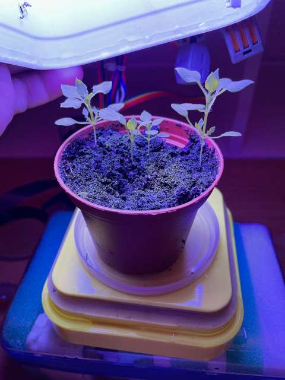
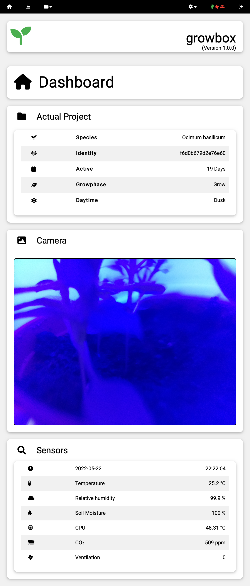
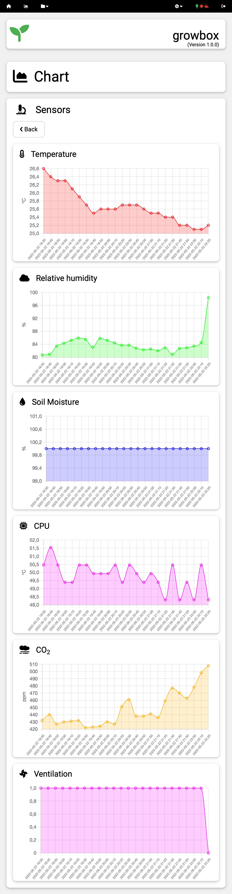
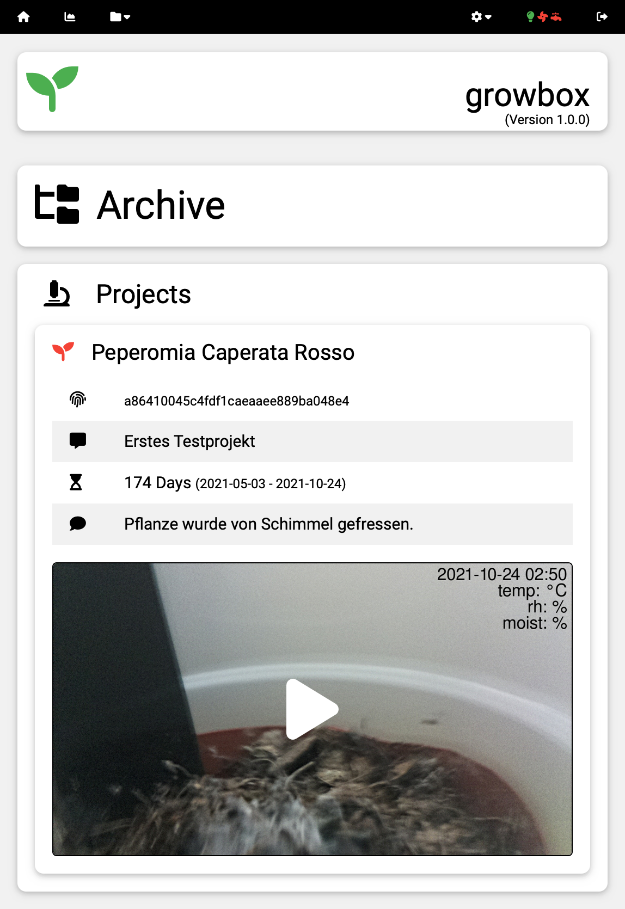
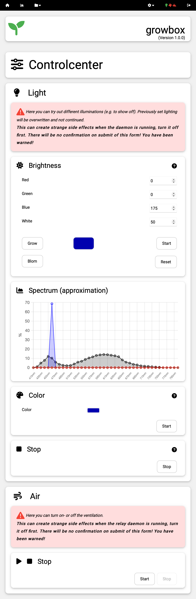

# growbox

Growbox is an application to manage and control a plant in a (somewhat) closed and controlled environment. 

## how it started

long story short: While i had a (extremely rare, they said) bone tumor in my leg and was grounded for almost a year,
i needed something to keep me busy, to not freak out. My interests always were computing/coding, plants and science fiction.

Speaking of Sci-Fi, trekkie here. Remember the replicators? What a nice way to make things, so why not build one by myself?
Well.. unfortunately i'm not able to create a device that arranges matter the way i want. So i need some kind of self
programming matter - like a plant seed. Feed it with Matter and Energy (i.E. water, light, co2 and fertilizer) and the
plant is kind of replicating herself (after some amount of time). 
There are also some 'tuning knobs' i can use, like a special light spectrum for the grow and the bloom phase, automatic watering,
keeping humidity at some level and so on.

Because i already did some little private projects in php 3-5 (hello spaghetticode :) ages ago, i decided to make 
something with classes, a nice layout and some nifty ittybitty stuff.
I had a Raspberry PI laying around, so why not order some Sensors, a Neopixel RGBW 64 Matrix, learn python and put it all
together? 

> And it works! You'll find more photos in [MAKING](docs/MAKING.md)

At the moment i use an old Tupperware like box, about 15x15cm surface and approximately 20cm height. 

The box I have first sprayed from the outside white to increase the light output inside by reflection. 
Then I sprayed it black to avoid that in dark phases light from the outside penetrates into the interior. 
last but not least, I gave the whole thing another white paint, because it looks better that way (in my opinion). 

I covered the upper part of the box, because I mounted a Neopixel 64 RGBW matrix there (and a 3.3V / 5V logic level converter).
Neopixels get VERY hot when in use, Lady ada does not understate! I had some North- or Southbridge Heatsink and Fan laying
around, so i mounted both on top of the Neopixel and trigger the cooler after sunrise. It reduces heath noticeably!

Inside the box is a DHT22 digital temperature and humidity sensor, a Winsen MH-Z19C CO2 sensor and an analog capacitive soil 
moisture sensor connected to a Raspberry Pi 3B.

There is a relay with attached fans (and a peristaltic pump in the near future..). The fan for ventilating the growbox is 
mounted in a box itself, with a PVC tube to 'suck' the air out of the growbox on one end, some holes at the other end and some
filtering material in between.  

On the outside of the box I cleaned a 5x5mm "peephole" with nitro thinner to mount a Raspberry camera V2 to satisfy my
curiosity. (Note to self: next time try the positioning before painting and cover the peephole with tape...).

Afterwards I adapted several python scripts, ran them with cron jobs at certain times and so on. 
Around this, I also created an extensive web-frontend in PHP, e.g. to display the sensor data nicely, 
to show a current picture of the plant, to start/stop a project, the overview of past projects and the 
setting of various parameters like light mode (growphase / bloomphase) light duration, brightness air conditioning, watering
and many things more.

# Screenshots

Here are some screenshots from the default template.

## Dashboard

## Charts

## Archive

## Controlcenter

# Fair warning:

I can't guarantee that my way of wiring each component makes sense, or if something could explode 
and cripple the power supply to an entire block of houses. 
Nor can I guarantee that your Grow project will be a success. My first project, for example, 
was eaten by mold (which is not that uncommon, because a warm, humid environment is naturally a 
great home for mold. So clean everything well beforehand and sterilize the substrate. That event leaded me to the 
conclusion, that i really NEED some kind of airconditioning).

# Don't ask me how to grow dope (seriously.)

Because it's way beyond the scope of this project, and it may be illegal in your country also.
So, no. You can't use your growbox with dope, it will break the growbox. 
Nice when it's legal in your country, im jealous ^^ 
Probably it wont break your growbox then, remember to adjust the Heisenberg Compensator.

## Getting started

Download the Tarball, unpack it, run the setup script growbox/scripts/setup/setup.sh 
You'll find more information in [INSTALL](docs/INSTALL.md) ! Then connect to the web frontend and read books 
about plant growth and stuff like that. Yay, books :-)

## Contributing

Contributors are welcome!

## License

Here you can contribute first, as i have absolutely no idea what license i should use.
feel free to open an issue!

other software used in this project: 
- chart.js
- fontawesome (parts of, the whole thing is 20mb big, and i just use ~24 icons, so i wiped the rest)
- w3.css
- a module based on the MCP3008.py class [tutorials-raspberrypi.de](https://tutorials-raspberrypi.de/raspberry-pi-mcp3008-analoge-signale-auslesen/)
- some adafruit circuitpython classes for reading the sensors
- parsedown
- a module based on the mh_z19 python library by Dr. Takeyuki Ueda [github](https://github.com/UedaTakeyuki/mh-z19) 

hopefully no one sues me for using/changing their work. if you don't want it used that way,
or if i credited you not enough or the wrong way, please just contact me and tell me what i should do. 
