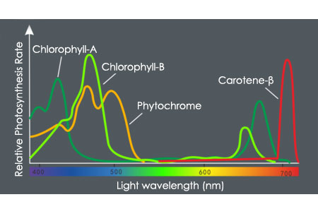
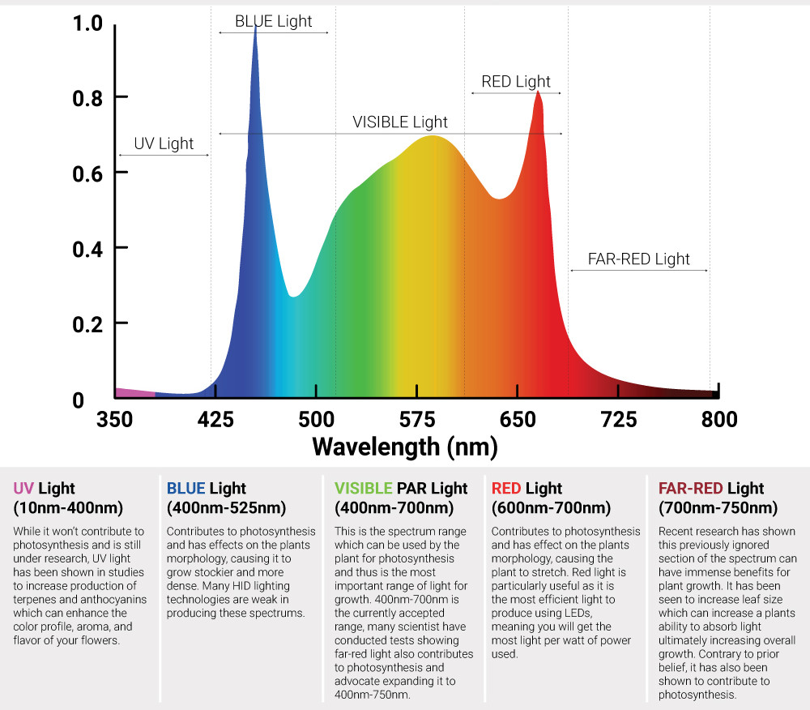
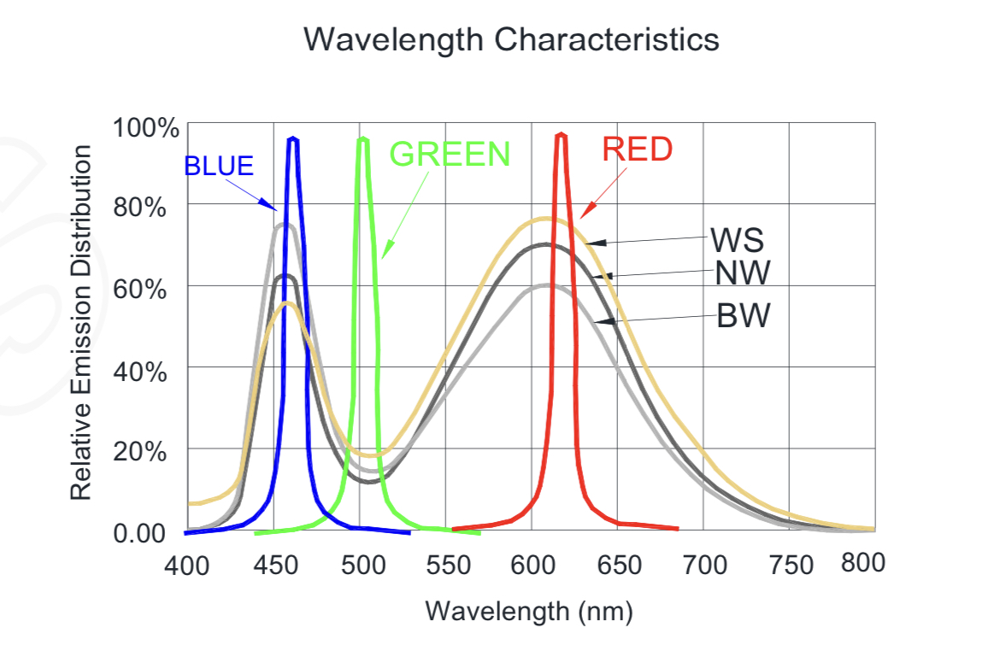

# Light

## Photosynthesis

As you may already know, plants use photosynthesis to generate their energy. They use 
light, water and carbondioxide to synthesize glucose and oxygen.

the three main factors that influence the photosynthesis rate are light, temperature and co2 (of course, water and 
mineral supply are important too).

So - you guess it - photosynthesis is depending on the energy of the light and the spectrum.
Plants have color pigments on their leafes, mainly chlorophylls where photons of a certain
spectrum can "impact".

In order to capture enough light energy, chlorophyll molecules, together with 
other pigments such as carotenoids and xanthophylls, form so-called 
light-collecting complexes that can capture a wider range of wavelengths. 
Chlorophylls (there are chlorophyll a and b) collect mainly blue and red light,
carotenoids and xanthophylls usually red to yellow light. 
Light of "green" wavelengths (520 to 565 nanometers (nm) 
and dark red wavelengths (around 730 nm) is reflected. 
Therefore, leaves appear green, with the dark red light being outshone by 
the green. ([excerpt from pflanzenforschung.de](https://www.pflanzenforschung.de/de/pflanzenwissen/lexikon-a-z/lichtreaktion-photosynthese-288))

below you can see a chart with the relative photosynthesis rates of certain molecules depending on the light wavelength:

Unfortunately i can't remember where this picture was from - so if you are the autor of that picture please don't sue me! 
get in contact that i can either remove the picture (which would be a pity, because it's informative!)
or credit you the right way!

Below is a grow spectrum, somewhat explaining the effects of the relative wavelengths:

Again: unfortunately i can't remember where this picture is from - so if you are the autor of that picture please don't sue me!
get in contact that i can either remove the picture (which would be a pity, because it's informative!)
or credit you the right way! 

## Neopixel Spectrum

This is the Spectrum from the Datasheet of the Neopixel RGBW natural white (~4500K) 64 matrix:

[adafruit](https://cdn-shop.adafruit.com/product-files/2757/p2757_SK6812RGBW_REV01.pdf)

NW means the light curve of the natural white LED.

## RGBW brightness

As you can see, the charts differ a bit, so we try to get as near to the spectrum as possible. 
we can set the individual brightness of the red, green, blue and white LED from 0 (dark) to
255 (maximal brightness). Keep in mind, that the Neopixel matrix gets very hot and possibly needs
some cooling!

Here are my (not scientifically accurate!) values for each growphase:

| LED | Grow | Bloom |
|-----|------|-------|
| R   | 100  | 255   |
| G   | 0    | 0     |
| B   | 255  | 100   |
| W   | 200  | 200   |

I tend to more blue light and less red for the plant growth phase and vice versa for
the bloom phase. These values are not yet really tested in real life and for different plants
as the first testproject was the "cloning" of a leaf from a peperomia caperata. I guess
i can reduce the amount of red in the growphase to 50 and same for blue while blooming.