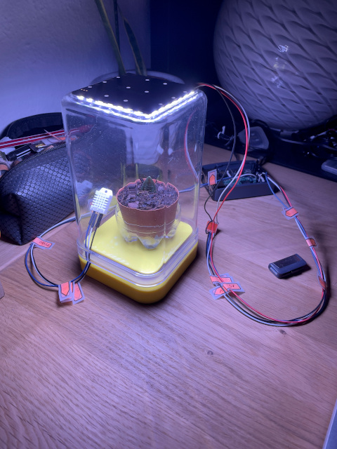
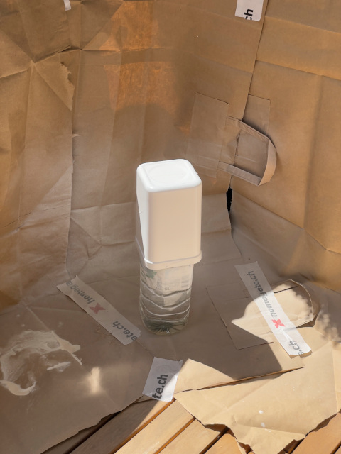
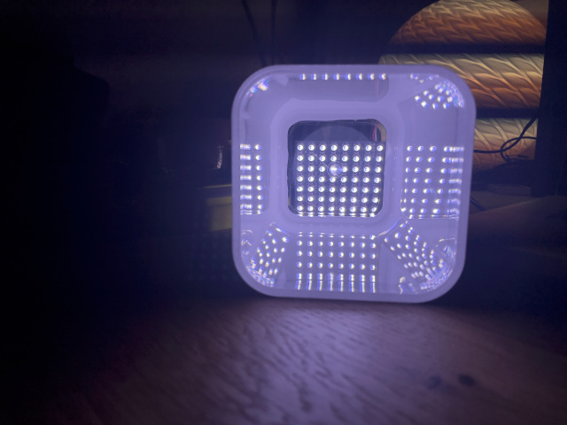
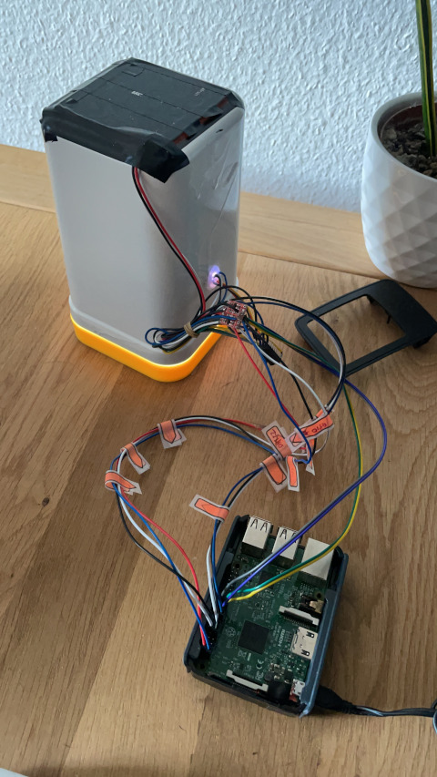
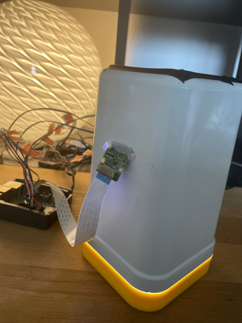
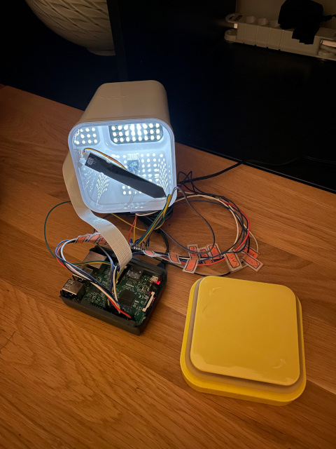
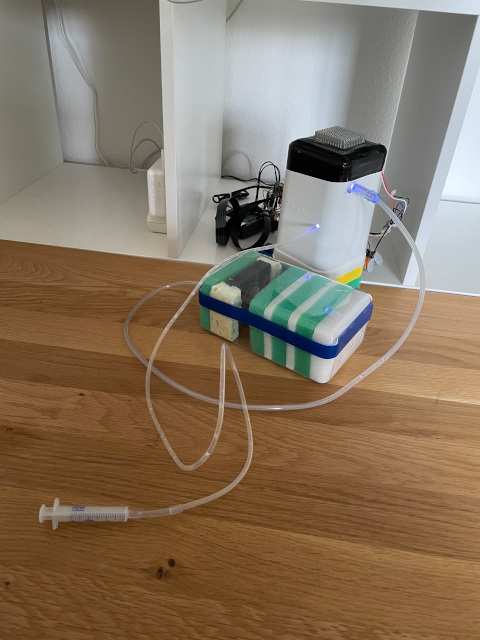
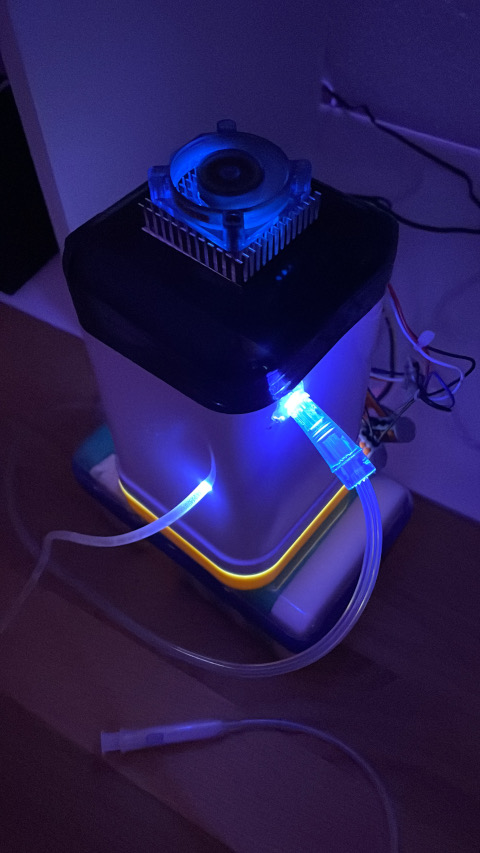

# Making of my own growbox

Here i'll show some pictures of the making of my own growbox. It's merely a prototype and thus a bit small.

## The Prototype

Who tought that the Neopixel RGBW 8x8 Matrix fits so nicely on my box!

## Spraying

Very reflective white. Fortunately we were not short of masks during the pandemic...

## Shiny bright LEDs

My plan worked out, the light gets reflected and strayed from the white spraypaint.

## Assembling

Drilling holes and fill them with hotglue.

## Light, Camera, Action!

After cleaning a peephole into the spraypaint, the camera also received some hotglue love.

## Ready to start a new project

There is a soilmoisture sensor, and the good old DHT-22 sensor attached.

## Airconditioning

I put a 12V fan into a box and added some filtering material. The fan is controlled by the relaydaemon, commanding a 
2-channel relay There is a hole in the bottom of the growbox to let air in. The fan-box sucks the air in with a tube 
connected to the growbox. I also attached a Heatsink on the neopixels, because it got so hot that my partner 
was afraid our house might burn down. Because i have no pump yet, i use an syringe to feed the plant with water and fertilizer.

## Look ma, it glows in the dark

Because i found that the heatsink was not enough, i installed a fan on it and let it control directly with the lightdaemon.
Now i need a relay with more channels, i guess ^^

## Living plants

And it seems to work out. Say hello to four plants of the species ocimum basilicum!
